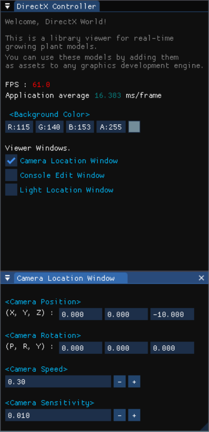
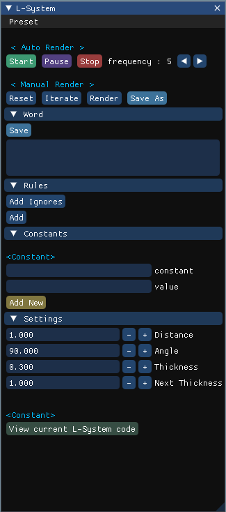
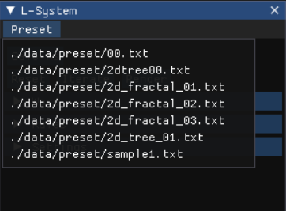

# The Algorithmic Beauty of Plants
식물의 성장을 알고리즘화하여 생성하고 DirectX를 활용하여 Timelapse와 같은 방법으로 시각화하는 프로젝트입니다.
- L-system에 기초하여 직접 나무와 꽃을 생성해볼 수 있습니다.
- Unreal 엔진에서 사용할 수 있도록 라이브러리로 만들어 배포할 예정입니다.

This is the project of creating a plant's growth by algorithm and visualize it with Timelapse utilizing DirectX.
- Based on L-System, you can create trees and flowers on your own.
- We are going to make it as a library and distribute it so that it can be used at Unreal engine.

## 팀 소개

### DirectX Viewer, Library
- ****3143 이제현
- ****1660 이수아

### Growth System
- ****1655 이동훈
- ****0694 방지완

## Preview
### 시연 동영상
[](https://youtu.be/R9rPVV2W3PQ)

## Guides
### Symbol

|Symbol|Description| |
|---|---|---|
|`F`|Move forward|Drawing (cube, cylinder)|
|`f`|Move forward|No drawing |
|`[`|Save the state (push)|position, angle|
|`]`|Restore the state (pop)|same|
|`+`|Turn left|RU (+angle)|
|`-`|Turn right|RU (-angle)|
|`&`|Pitch down|RL (+angle)|
|`^`|Pitch up|RL (-angle)|
|`\\`|Roll left|RH (+angle)|
|`/`|Roll right|RH (-angle)|
|`\|`|Turn around|RU (+180.0f)|
|`{`|Start drawing a leaf||
|`.`|Save this position by leaf vertex||
|`}`|End drawing a leaf||

### LSystem
1. 시작 Word 설정
    ```
    lSystem->SetWord("A");
    ```
2. Rule 설정
    ```
    lSystem->AddRule('A', "B - F + CFC + F - D & F^D - F + && CFC + F + B//");
    lSystem->AddRule('B', "A & F^CFB^F^D^^ - F - D^ | F^B | FC^F^A//");
    lSystem->AddRule('C', "D^ | F^B - F + C^F^A && FA & F^C + F + B^F^D//");
    lSystem->AddRule('D', "CFB - F + B | FA & F^A && FB - F + B | FC//");
    ```
3. Parameter 설정
    ```
    lSystem->SetDistance(2.0f);
    lSystem->SetAngleChange(90.0f);
    ```
4. 실행
    ```
    lSystem->Iterate(2);            // 반복

    lSystem.GetResultView(out);
    ```

### Simulator
#### Controller widget


FPS와 Backgroud color 등 시뮬레이터 옵션과 카메라 옵션을 수정할 수 있습니다.

#### L-System widget


##### Word
초기 상태(symbols) 입력입니다. Iterate 할 때마다 변환 규칙이 적용된 word로 수정됩니다.

##### Rule
변환 규칙 입력입니다. `+` 버튼을 통해 규칙을 추가할 수 있습니다. 동일한 Key의 변환 규칙이 추가되는 경우 의도하지 않은 결과가 나올 수도 있습니다.

##### Paramters

|Parameter|Description|Preset key|
|---|---|---|
|Distance|Forward 거리|`distance`|
|Angle|각도 조절 시 회전각도 (degree)|`angle`|
|Thickness|두께|`thickness`|
|Next Thickness|두께 변화량 (before * deltaThickness)|`deltaThickness`| 

##### Preset


`Preset` 탭에서 미리 등록된 프리셋을 읽어올 수 있습니다. 새로 생성하거나 수정한 상태에서 `Save As` 버튼을 눌러 새로운 프리셋을 생성할 수 있습니다. Iterate 정보는 저장되지 않습니다. Parameter 정보는 위 테이블 Preset key를 기준으로 저장됩니다.

###### Example
Preset은 `abop/data/preset/`에 저장됩니다.
> `abop/data/preset/2d_tree_01.txt`
```
angle:22.500000
thickness:0.300000
deltaThickness:1.000000
word:X
X:F-[[X]+X]+F[+FX]-X
F:FF
end
```
