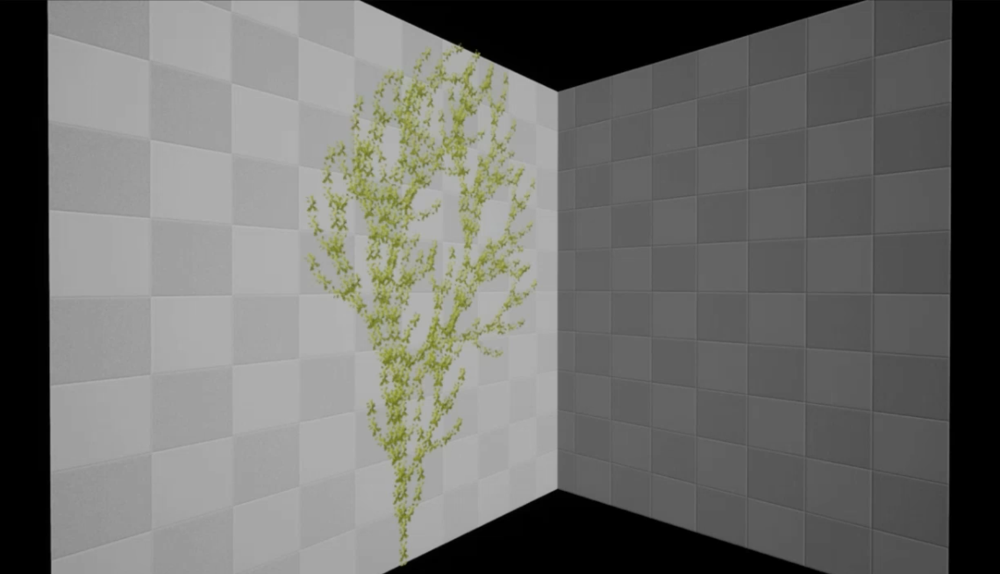

[](https://classroom.github.com/online_ide?assignment_repo_id=10124796&assignment_repo_type=AssignmentRepo)
# [The Algorithmic Beauty of Plants](https://kookmin-sw.github.io/capstone-2023-19/)
식물의 성장을 알고리즘화하여 생성하고, DirectX 기반으로 시간의 흐름에 따라 렌더링하는 프로젝트이다. DirectX 환경 시뮬레이터에서 사용자가 임의대로 모델의 규칙과 파라미터를 조정하여 2D 및 3D 그래픽 디자인 개발에 사용할 수 있는 다양한 종류의 식물 모델 생성할 수 있으며 생성한 모델을 Unreal Engine과 같은 게임 엔진에서 사용 가능하다.

This is a project that algorithmizes and generates plant growth and renders it over time based on DirectX. In the DirectX environment simulator, users can arbitrarily adjust the rules and parameters of the model to create a variety of plant models that can be used to develop 2D and 3D graphic designs, and the models they create are available in game engines such as Unreal Engine.

## Preview
### 소개 영상

|1|2|
|-|-|
|[](https://youtu.be/R9rPVV2W3PQ)|[](https://www.youtube.com/watch?v=_pugUGXtPZ0&ab_channel=JHdev)|

### DirectX Rendering

|Preset name|Result|
|-|-|
|02_2d_fractal_2||
|03_2d_fractal_3||
|05_context_1||
|08_branching_pattern||
|10_flower_2||
|11_3d_tree||

### Unreal Rendering

|Preset name|Result|
|-|-|
|11_3d_tree||
|12_vine||

## 팀 소개

|학번|이름|역할|
|:-:|:-:|:-:|
|20181655|이동훈|Growth system|
|20190694|방지완|Growth system|
|20181660|이수아|DirectX, Unreal|
|20163143|이제현|DirectX, Unreal|

## 프로젝트 구조


## Guides
C++ 언어 표준: ISO C++17 표준

### DirectX
1. `abop.sln` 프로젝트 열기

2. AutoDesk FBX .SDK 설치
    
    `.fbx` 모델 파일을 읽기 위해 SDK가 설치되어야 합니다. 사용하는 Visual Studio version에 맞추어 설치 ([AutoDesk FBX SDK](https://www.autodesk.com/developer-network/platform-technologies/fbx-sdk-2020-2-1))

    SDK 경로가 잘못된 경우 다음과 같이 설정합니다.
    - Header files 경로 설정
        - 프로젝트 속성 > C/C++ > 일반 > 추가 포함 디렉토리
        - *{FBX_SDK_DIR}/{FBX_SDK_VERSION}/include*
    - `.lib` files 경로 설정
        - 프로젝트 속성 > 링커 > 일반 > 추가 라이브러리 디렉토리
        - *{FBX_SDK_DIR}/{FBX_SDK_VERSION}/lib/**vs2019**/**x64**/**releaes**/*
    - `.dll` file 위치
        - *{PROJECT_DIR}/**x64**/**release**/*
    
    L-system Simulator 사용 가이드는 아래 참고

3. `Preset tab`을 통해 완성된 모델들을 확인할 수 있습니다.

### Unreal
1. Unreal Engine 4로 `unreal/unreal.uproject` 프로젝트 열기
2. 아래 경로에 다음 asset을 설치합니다.

    [unreal/Content/BarkPack/](https://www.unrealengine.com/marketplace/ko/item/888e1b5dac154f23b72ebe935bc5cd6b)

    [unreal/Content/MS_BushLeafV1/](https://www.unrealengine.com/marketplace/ko/item/378e93bf02374e4c9169e0261c44f5fd)
3. 헤더 파일과 `abop.lib`를 사용하는 UE 폴더의 ThirdParty로 추가합니다.
    - *{UE_DIR}/Engine/Source/ThirdParty/* 에 `abop` 폴더 생성
    - 해당 폴더 내 *include/* 폴더에 모든 헤더 파일 이동
    - ***bin_x64/*** 폴더에 `abop.lib` 파일 이동

4. `default.umap`, `vine.umap`을 통해 완성된 모델들을 확인할 수 있습니다.

### L system simulator


#### DirectX Controller widget
FPS와 Backgroud color 등 시뮬레이터 옵션과 카메라 옵션을 수정할 수 있습니다.


#### L-System widget


#### Auto Render

|||
|-|-|
|**Start**|일정 주기로 `Iterate`, `Render`를 반복합니다.|
|**Start**|일시 정지합니다.|
|**Stop**|이전 상태로 돌아갑니다.|
|**frequency**|`Iterate`, `Render` 빈도를 조절합니다.|

#### Manual Render

|||
|-|-|
|**Reset**|모든 설정 및 입력을 초기화 합니다.|
|**Iterate**|변환 규칙이 적용된 word로 수정됩니다.|
|**Render**|현재 word를 기준으로 렌더링 됩니다. 모델은 (0, 0, 0) 원점에서 렌더링이 시작됩니다.|

#### Word
초기 상태(symbols) 입력입니다. `Iterate` 및 `Save As` 전 `Save`를 클릭하여 저장해야 합니다. 아래 `View current L-System code` 버튼을 눌러 전체 word를 자세하게 볼 수 있습니다.

#### Rules

|||
|-|-|
|**Add Ignores**|변환 규칙 중 무시되는 Symbol을 설정합니다. symbol context를 확인할 때와 해당 symbol로 선언된 rule을 모두 무시합니다.|
|**Add**|변환 규칙을 추가 합니다.|

- Rule 예시
    ```
    ex.
        // generic (동일한 key가 있는 경우 확률 적용)
        // F is FF
        key F
        value FF

        // context-sensitive
        // ABF is ABCDEF
        key A < B > F
        value BCDE

        // parametric 
        // F(6, 7) is FF(6, 8)FF
        key F(s, t)
        value FF(s, t+1)FF

        // parametric + condition
        // F(7) is F(59)
        key F(t) : t - 5 > 0
        value F(t * 6 + 17)F

        // context-sensitive + parametric + condition
        // A(3)B(6) is A(3)[FF+]FF
        key A(c) < B(k) : c + k = 9
        value [FF+]FF
    ```
- Symbols

    이 프로젝트에서 사용되고 있는 symbol 입니다.

    |Symbol|Description|Parameters|
    |---|---|---|
    |`F`|Move forward|distance, thickness|
    |`f`|Move forward (no drawing)||
    |`G`|Move forward (no drawing, for drawing leaf)||
    |`J`|Load .fbx model 1||
    |`K`|Load .fbx model 2||
    |`[`|Save the state (push)||
    |`]`|Restore the state (pop)||
    |`+`|Turn left|RU (+angle)|
    |`-`|Turn right|RU (-angle)|
    |`&`|Pitch down|RL (+angle)|
    |`^`|Pitch up|RL (-angle)|
    |`\\`|Roll left|RH (+angle)|
    |`/`|Roll right|RH (-angle)|
    |`\|`|Turn around||
    |`{`|Start drawing a leaf||
    |`.`|Save this position by leaf vertex||
    |`}`|End drawing a leaf||

#### Constants
상수를 추가합니다. 성장 속도, 최대 두께 등을 constant symbol로 추가하여 동일한 프리셋으로 다양한 모델을 만들 수 있습니다.

#### Settings

|Parameter|Description|Preset key|
|---|---|---|
|Distance|Forward 거리|`distance`|
|Angle|각도 조절 시 회전각도 (degree)|`angle`|
|Thickness|두께|`thickness`|
|Next Thickness|두께 변화량 (before * deltaThickness)|`deltaThickness`| 

#### Preset
`Preset` 탭에서 미리 등록된 프리셋을 읽어올 수 있습니다. 새로 생성하거나 수정한 상태에서 `Save As` 버튼을 눌러 새로운 프리셋을 생성할 수 있습니다.


- Preset은 `abop/data/preset/`에 저장됩니다.
    > `abop/data/preset/2d_tree_01.txt`
    ```
    angle:22.500000
    thickness:0.300000
    deltaThickness:1.000000
    word:X
    rule
    X:F-[[X]+X]+F[+FX]-X
    F:FF
    end
    ```
